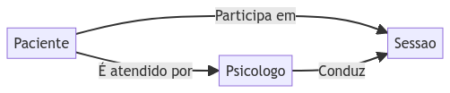
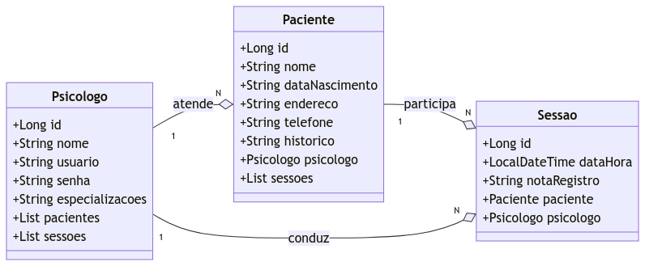

# Sistema ERP para Psicólogos

Este é um projeto de sistema de gerenciamento de sessões para psicólogos, desenvolvido como parte de um estudo de programação. O sistema permite que psicólogos registrem informações sobre seus pacientes e suas sessões de terapia.

## Funcionalidades Principais

- Um Psicologo pode atender vários Pacientes e conduzir várias Sessoes.
- Um Paciente é atendido por apenas um Psicologo e participa de várias Sessoes.
- Um Psicologo conduz várias Sessoes com diferentes Pacientes.

## Tecnologias Utilizadas

- Java 17
- Spring Boot
- Spring Security
- Banco de Dados H2 (para desenvolvimento)
- ...

## Como Funciona

Este projeto utiliza o framework Spring Boot para criar uma aplicação RESTful que permite o cadastro de psicólogos, pacientes e o agendamento de sessões. Os psicólogos podem se autenticar no sistema, adicionar pacientes, agendar sessões com eles e registrar informações sobre cada sessão.

  

  

  

Este projeto serve como uma base sólida para o desenvolvimento de um sistema de gerenciamento de consultório para psicólogos. Estou utilizando dele para aprimorar minhas habilidades em Java.
